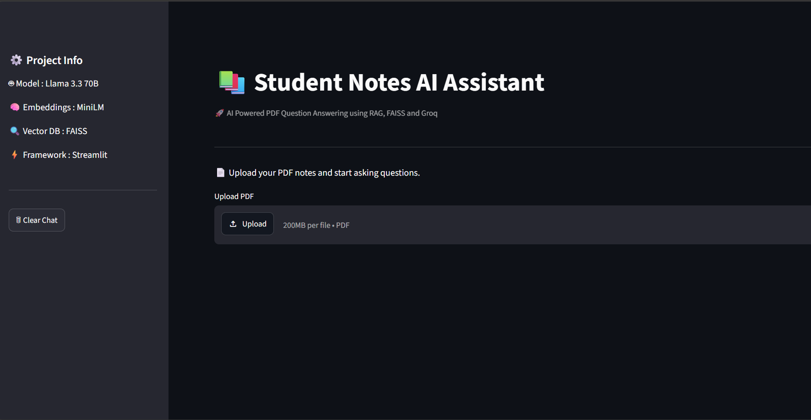
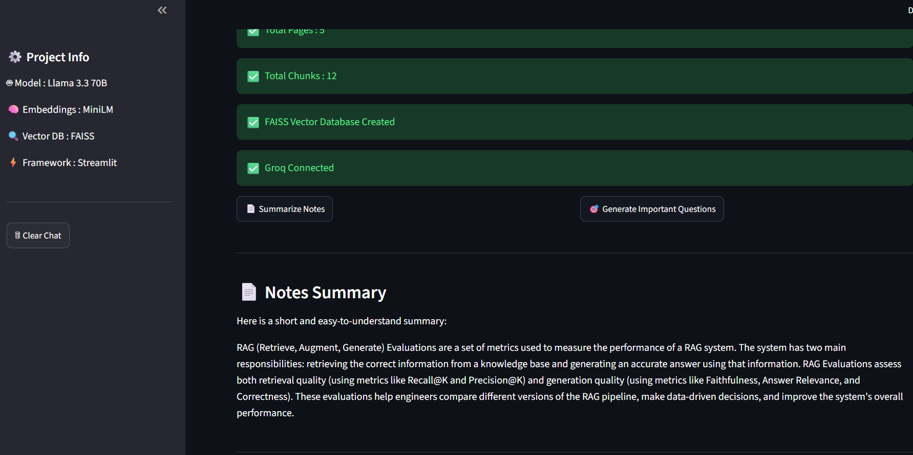
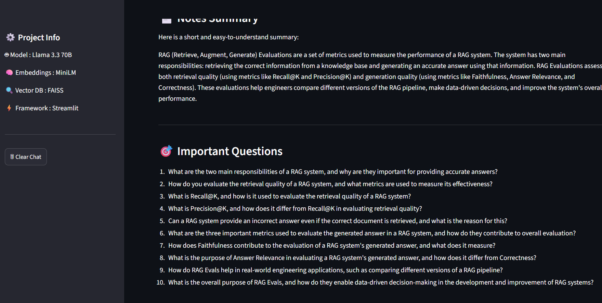
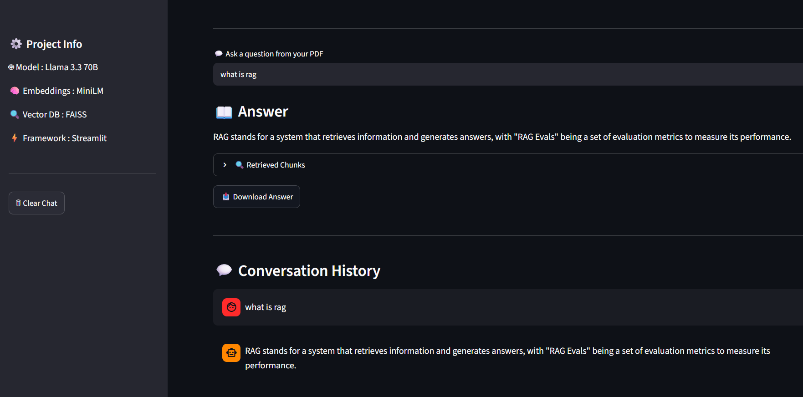
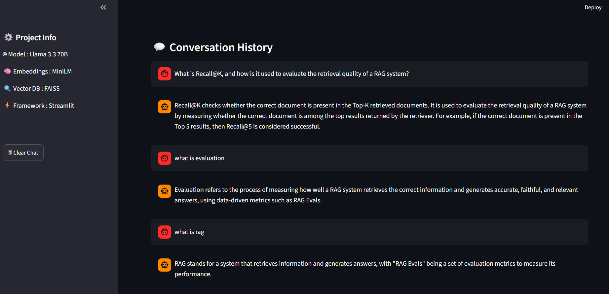
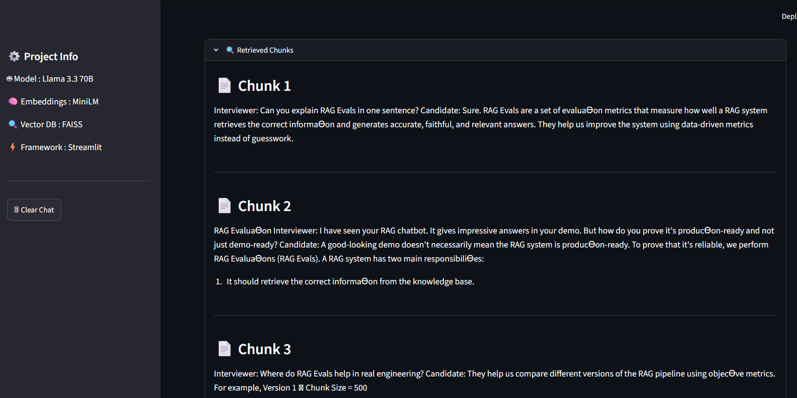

# 📚 Student Notes AI Assistant

An AI-powered Student Notes Assistant built using **Python, Streamlit, LangChain, FAISS, HuggingFace Embeddings, and Groq LLM**.

This application allows students to upload PDF notes, ask questions, generate summaries, and create important exam questions using Retrieval-Augmented Generation (RAG).

---

# 🚀 Features

- 📄 Upload PDF Notes
- 💬 Ask Questions from PDF
- 📄 Generate Notes Summary
- 🎯 Generate Important Exam Questions
- 🔍 Semantic Search using FAISS
- 🧠 HuggingFace Embeddings
- 🤖 Groq LLM Integration
- 💬 Chat History
- 📥 Download AI Answer
- 📂 Retrieved Context Chunks

---

# 🛠 Tech Stack

- Python
- Streamlit
- LangChain
- FAISS
- HuggingFace Embeddings
- Groq API
- PyMuPDF
---

# ⚙️ Installation

## Clone the Repository

```bash
git clone https://github.com/your-username/student-notes-rag-assistant.git
```

## Navigate to Project Folder

```bash
cd student-notes-rag-assistant
```

## Create Virtual Environment

```bash
python -m venv venv
```

## Activate Virtual Environment

### Windows

```bash
venv\Scripts\activate
```

### Linux / macOS

```bash
source venv/bin/activate
```

## Install Dependencies

```bash
pip install -r requirements.txt
```

## Add API Key

Create a `.env` file in the project root.

```text
GROQ_API_KEY=your_api_key_here
```

## Run the Application

```bash
streamlit run app.py
```

---

# 📸 Screenshots

Add screenshots of the following:

- Home Page
- PDF Upload
- Notes Summary
- Important Questions
- Question Answering
- Retrieved Chunks

---

# 🔮 Future Improvements

- Multiple PDF Support
- Citation-Based Answers
- Dark Mode
- User Authentication
- Chat Export
- PDF Summary Download

---

# ⚠️ Known Limitation

Some PDFs created with custom fonts or ligatures may display special characters during text extraction. This is a limitation of PDF extraction libraries and does not affect the retrieval or answer generation pipeline.

---

# 👨‍💻 Author

**Sampada Thombare**

Python | Data Science | Generative AI

---

# ⭐ If you like this project

Please consider giving this repository a ⭐ on GitHub.
# 📸 Screenshots
## 🏠 Home Page



---

## 📄 Notes Summary



---

## 🎯 Important Questions



---

## 💬 Question Answering



---

## 🗂 Conversation History



---

## 🔍 Retrieved Chunks


---

# ⚠️ Known Limitations

Some PDF files may display special characters (for example, "EvaluaƟon" instead of "Evaluation") due to PDF font encoding and text extraction limitations.

This issue does not affect:

- Semantic Search
- FAISS Retrieval
- Question Answering
- Notes Summary
- Important Question Generation

The RAG pipeline continues to function correctly.